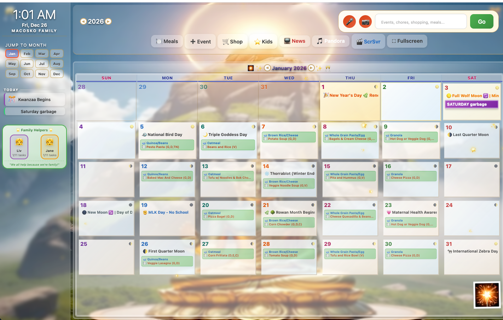

# Family Planner Dashboard



**A Skylight Calendar-inspired family command center with voice control, OCR document scanning, AI assistant, and dynamic seasonal themes.**

> Built this because I wanted a fully customizable family hub that I control. Runs on a spare iPad and does everything - voice commands, document scanning, meal planning, chore tracking with celebrations, and ambient video screensavers. No subscriptions, no cloud dependency.

---

## What It Does

```
┌─────────────────────────────────────────────────────────────────┐
│  🎙️ VOICE    │  📸 OCR SCAN  │  🤖 AI CHAT   │  📺 SCREENSAVER │
├─────────────────────────────────────────────────────────────────┤
│                                                                 │
│   📅 CALENDAR          │    🍽️ MEAL PLANNER                    │
│   ├─ Events            │    ├─ Weekly meals                    │
│   ├─ Holidays          │    ├─ School lunch menus              │
│   ├─ Moon phases       │    └─ Voice: "Tacos for Friday"       │
│   ├─ Weather forecast  │                                       │
│   └─ Seasonal themes   │    🛒 SHOPPING LIST                   │
│                        │    └─ Voice: "Add milk"               │
│   ⭐ KIDS CHORES       │                                       │
│   ├─ Task tracking     │    🎬 MONTHLY SCREENSAVERS            │
│   ├─ Celebrations!     │    ├─ Seasonal video backgrounds      │
│   └─ No points needed  │    └─ Ocean idle screensaver          │
│                        │                                       │
└─────────────────────────────────────────────────────────────────┘
```

---

## Features

### 🎙️ Voice Commands (Works Everywhere)
Just talk to it. Uses Web Speech API with OpenAI Whisper fallback for accuracy.

```
"Add dentist appointment Tuesday at 3pm"
"Emma brushed her teeth"
"Plan spaghetti for Wednesday"
"Add eggs to the shopping list"
```

The voice bar is everywhere - calendar, meals, chores, shopping. Speak naturally.

### 📸 OCR Document Scanning
Point your camera at a school flyer, sports schedule, or event poster. The system:
1. Captures the image
2. Sends to Claude Vision API
3. Extracts dates, times, and event names
4. Shows you what it found
5. One click to add to calendar

No more manually typing in school newsletters.

### 🤖 Fia - AI Family Assistant
Chat interface powered by Claude. Ask anything:
- "What's on the calendar today?"
- "What's for dinner?"
- "How are the kids doing with chores?"
- "Add a playdate with the Johnsons on Saturday"

Fia understands context and can modify your calendar, shopping list, and meal plan.

### 📅 Dynamic Calendar with Themes
- **Seasonal backgrounds** - December has snow video, January has sparkles
- **Moon phases** on every day
- **Weather forecast** integration (7-day)
- **Color-coded events** by family member
- **US holidays** built in for 2025-2026

### ⭐ Kids Chore System (No Points!)
We tried the point system. Kids gamed it. Now it's simple:
- Tap a chore when done
- Get a **celebration** (slot machine, confetti, bubble pop)
- That's it. The reward IS the celebration.

Chores auto-reset daily. Parents can see progress at a glance.

### 🍽️ Meal Planning
- Weekly meal grid
- School lunch/breakfast menus (customizable)
- Favorite meals library
- Voice: "Plan pizza for Friday dinner"

### 🛒 Shopping List
- Add items by voice or text
- Check off as you shop
- Syncs across devices

### 📺 Screensaver System
- **Idle screensaver**: Ocean videos play when inactive (configurable timeout)
- **Monthly screensaver**: Click the button to see the current month's themed video
- Videos play at 25% speed for ambient effect

---

## Tech Stack

| Layer | Technology |
|-------|------------|
| Backend | Python 3 + built-in HTTPServer |
| Frontend | Vanilla JS, CSS (no frameworks) |
| Voice | Web Speech API + OpenAI Whisper |
| OCR | Claude Vision API |
| AI Chat | Claude API |
| Data | JSON files (simple, portable) |

**Why no frameworks?** This runs on an old iPad as a PWA. Every KB matters. Total JS is under 100KB.

---

## Architecture

```
┌─────────────────────┐     ┌─────────────────────┐
│   Browser (PWA)     │────▶│   Python Server     │
│   - Voice capture   │     │   - API endpoints   │
│   - Camera access   │     │   - File serving    │
│   - Offline capable │     │   - JSON storage    │
└─────────────────────┘     └─────────────────────┘
                                     │
                    ┌────────────────┴────────────────┐
                    ▼                                 ▼
            ┌───────────────┐               ┌───────────────┐
            │ OpenAI Whisper│               │  Claude API   │
            │ (voice→text)  │               │ (OCR + Chat)  │
            └───────────────┘               └───────────────┘
```

---

## File Structure

```
Family-Planner/
├── server.py           # Main HTTP server
├── data.py             # Family config, holidays, school menus
├── handlers.py         # JSON file operations
├── html_template.py    # Legacy single-file version
├── static/
│   ├── index.html      # Main dashboard
│   ├── css/
│   │   ├── variables.css   # Design tokens
│   │   ├── base.css        # Reset & typography
│   │   ├── layout.css      # Grid structure
│   │   ├── calendar.css    # Calendar styling
│   │   ├── components.css  # Buttons, modals, widgets
│   │   ├── themes.css      # Seasonal themes
│   │   └── responsive.css  # Mobile optimization
│   └── js/
│       ├── app.js          # Main app logic
│       ├── calendar.js     # Calendar rendering
│       ├── chores.js       # Kids task system
│       ├── meals.js        # Meal planning
│       ├── shopping.js     # Shopping list
│       ├── voice.js        # Speech recognition
│       ├── themes.js       # Seasonal theming
│       ├── celebrations.js # Kid reward animations
│       ├── screensaver.js  # Video screensaver
│       └── ocr.js          # Document scanning
├── video_ocean_*.mp4   # Screensaver videos
└── *.json              # Data files (gitignored)
```

---

## Setup

### 1. Clone & Install

```bash
git clone https://github.com/nicedreamzapp/Family-Planner.git
cd Family-Planner
python3 -m venv .venv
source .venv/bin/activate
pip install anthropic openai  # For AI features
```

### 2. Configure API Keys

```bash
export OPENAI_API_KEY="your-key"      # For Whisper voice transcription
export ANTHROPIC_API_KEY="your-key"   # For OCR and Fia chat
```

### 3. Run

```bash
python3 server.py
```

Open `http://localhost:8766` in your browser.

### 4. Install as PWA (Optional)

On iPad/iPhone Safari:
1. Go to your server's URL
2. Share → Add to Home Screen
3. Now it runs like a native app

---

## Customization

### Change Family Members
Edit `data.py`:
```python
FAMILY = {
    "dad": {"name": "Dad", "color": "#5B9BD5", "emoji": "👨", "role": "dad"},
    "mom": {"name": "Mom", "color": "#E36B9A", "emoji": "👩", "role": "mom"},
    "kid1": {"name": "Emma", "color": "#9B59B6", "emoji": "👧", "role": "daughter"},
    "kid2": {"name": "Sophie", "color": "#F39C12", "emoji": "👧", "role": "daughter"},
}
```

### Add Monthly Video Backgrounds
1. Add your video to `static/` (e.g., `february-bg.mp4`)
2. Edit `themes.js` to add the month:
```javascript
const MONTHLY_VIDEOS = {
    0: '/static/january-bg.mp4',
    1: '/static/february-bg.mp4',  // Add this
    11: '/static/december-bg.mp4'
};
```
3. Add CSS theme in `themes.css` (copy January theme, rename classes)

### Modify Chores
Edit `chores.json` or use the default in `handlers.py`.

---

## Voice Command Examples

| Say This | Result |
|----------|--------|
| "Dentist appointment Friday at 2" | Creates calendar event |
| "Emma made her bed" | Marks chore complete + celebration |
| "Add milk and eggs" | Adds to shopping list |
| "Tacos for Tuesday dinner" | Sets meal plan |
| "What's happening tomorrow?" | Fia reads calendar |

---

## Seasonal Themes

The calendar automatically applies themes based on the viewing month:

| Month | Theme | Features |
|-------|-------|----------|
| January | New Year | Sparkles, video background |
| February | Valentine's | Hearts, pink tones |
| October | Halloween | Pumpkins, orange/purple |
| December | Winter | Snow video, Christmas decorations |

Each theme adjusts:
- Background video/animation
- Corner decorations
- Color palette
- Particle effects

---

## Why I Built This

I wanted full control over my family's command center:
- **Self-hosted** - runs locally, no cloud dependency
- **Fully customizable** - change anything in the code
- **AI-powered** - Claude for OCR and chat, Whisper for voice
- **No subscriptions** - one-time setup, runs forever
- **Open source** - learn from it, modify it, make it yours

---

## License

MIT - Do whatever you want with it.

---

---

Built with Claude Code assistance.
